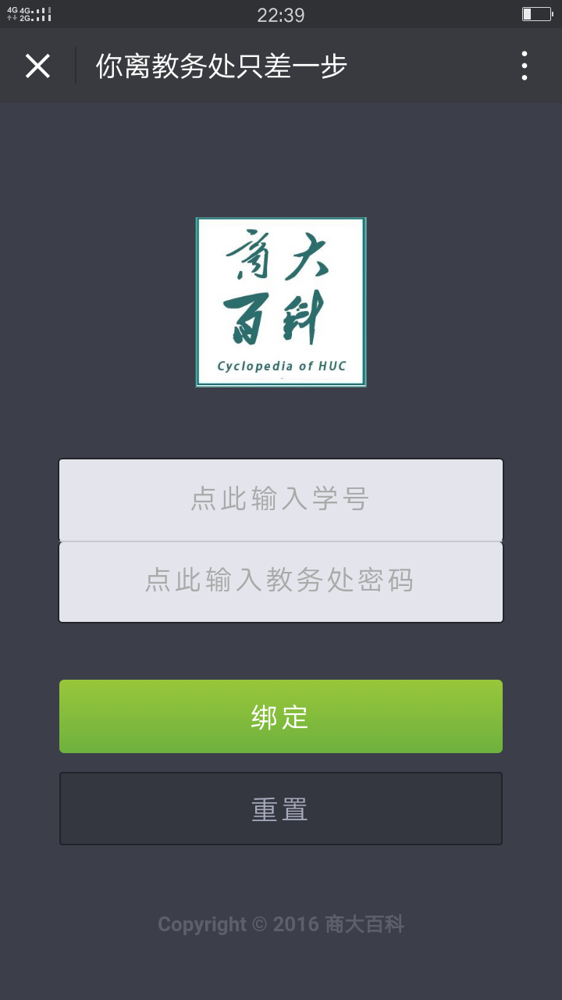
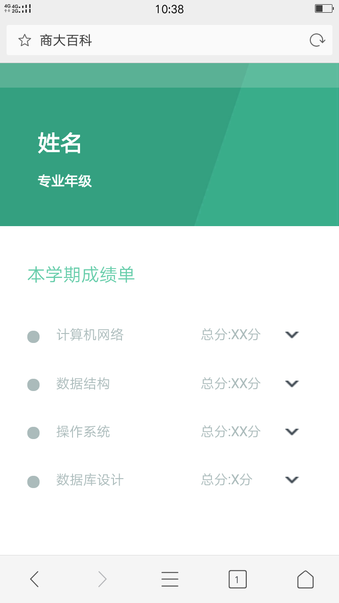
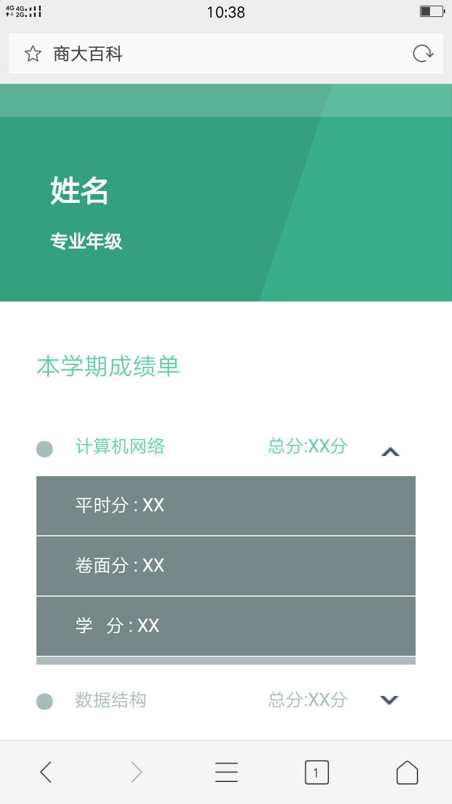
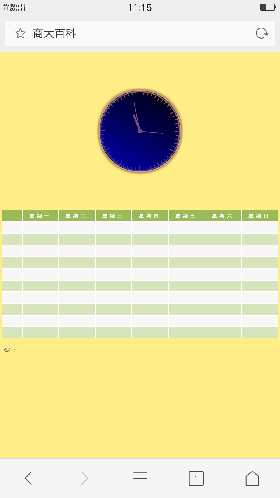
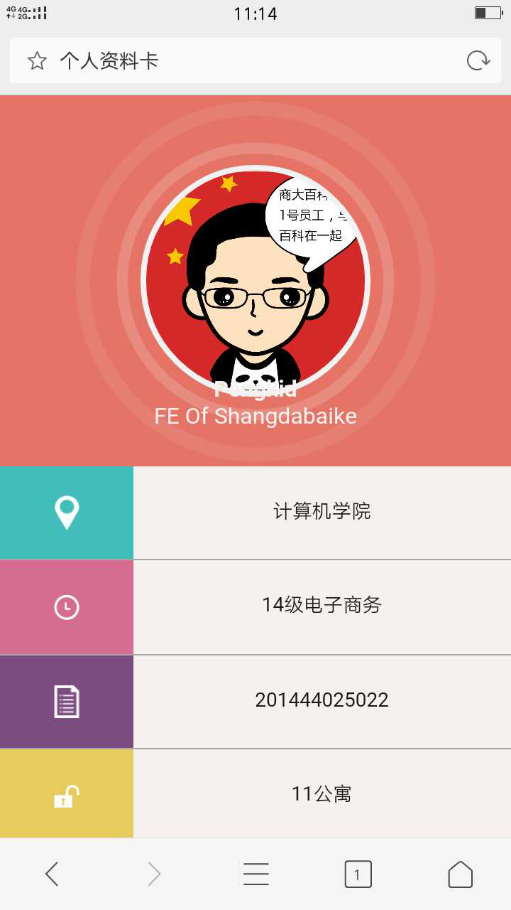
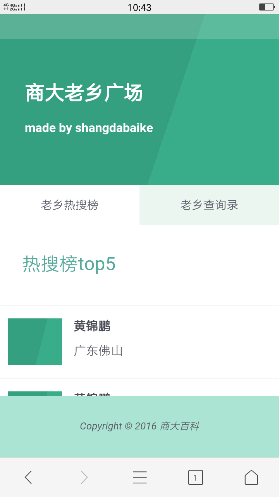
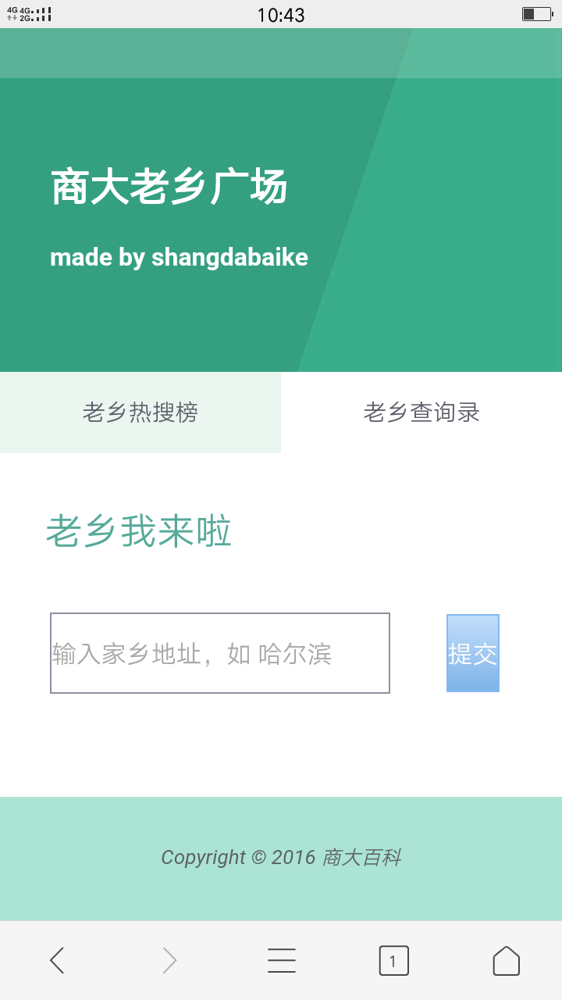

校园公众号“商大百科” — — 前端界面模板
===

> **商大百科** 是一个**校园微信公众号**，主要提供给**学生使用**，集课表、成绩、考试、空教室、学生查询、一卡通等各功能于一身，广受商大学生好评。
>
> **商大百科** 主力开发者@**DamonWong**，大神负责所有的后台功能开发。而本人是搬砖的，负责前台界面编写，当初是一颗前端弱菜（说得好像现在不是弱菜似得），界面也很粗糙啊，大概这叫新人的青涩吧。。。
>

## 绑定界面

> **CSS3动画：** 文档加载完毕之后分别是logo的向下淡入动画以及表单的向上淡入动画。（当初觉得写动画是神奇的一件事情）
>
> **表单验证：** 表单提交时JS触发表单验证，学号密码不能为空，以及学号长度必须是12位。
>

---

## 成绩界面

> **伪类动画：** 通过<label>绑定<input type="checkbox" />，点击<label>触发**伪类input:checked**，进而控制成绩详情单的展开和收起（height的变化）。实际上就是针对正常状态下的<input>和选择状态下的<input>写两种样式。
>
> **响应式布局：** 通过CSS媒体查询适配移动端设备，主要是针对480px和320px作出样式的像素大小调整。其实不太喜欢用媒体查询，毕竟手机尺寸五花八门的。后来在论坛上看到一种更优雅的方法是**rem布局**，大体上指的是html根元素上定义一个字体大小，然后css样式定义时都使用rem作为单位。然后js根据手机设备的屏幕大小，改变根字体的大小，这样整个页面也会跟着相应的缩小或放大。
>

---

## 课表界面

> **移动端适配**：解决了<table>各列不等分的问题。 
>

---

## 个人资料卡界面

> **CSS布局：** 一个个人资料卡的静态界面。用来实战CSS布局的，用绝对定位实现两列布局等。
>
> **伪元素：** 这是我第一次使用了伪元素的界面。发现伪元素是个好东西，可以减少对
的依赖，主要是用::after配合绝对定位，实现一个小图标的展示。
>

---

## 商大老乡会

> **AJAX交互：** 一个比较鸡肋的功能 — — 找同校老乡。主要是通过表单数据提交，然后AJAX传参数给后端，执行数据库的查询。后端返回数据，然后前端遍历每个数据，直接操作DOM生成元素节点和文本节点，形成一个信息列表呈现给学生。
>

---
